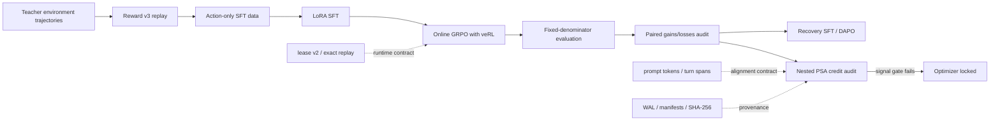

# Shopping GRPO Long-Horizon

<div align="center">

**English** · [简体中文](README.md)

**Auditable post-training and failure diagnosis for long-horizon tool agents**

[](pyproject.toml)
[](https://github.com/QwenLM/Qwen3)
[](https://github.com/verl-project/verl)
[](https://arxiv.org/pdf/2601.18225)
[](docs/evaluation.md)

Teacher rollouts and action-only SFT → online GRPO → fixed evaluation → paired
failure analysis → local credit audit

</div>


> [!IMPORTANT]
> **Bottom line:** the repository closes the data, training, replay, evaluation
> and failure-diagnosis loop, but the experiments do **not** support a claim
> that GRPO or PSA improves the SFT policy. Two-seed GRPO V2 scored `115/200`
> versus SFT's `117/200` on the now-known Final-200 regression set
> (McNemar `p=.839`). Three Nested PSA confirmations passed engineering and
> structural checks but failed preregistered signal gates, so the optimizer
> remained locked.

## Problem

A ShopSimulator agent must search, compare products, inspect evidence, choose
variants and decide when to buy or stop. Failures often occur tens of tool
steps after the decision that caused them. A terminal reward alone cannot show
which query, product opening, option selection or stopping decision deserves
credit.

The project therefore asks a sequence of smaller causal questions before
changing the optimization algorithm:

```text
Is the teacher trajectory executable?
→ Can reward and public state be replayed exactly?
→ Did valid GRPO groups actually reach the optimizer?
→ Which paired trajectories changed after training?
→ Does local decision credit replicate on independent continuations?
→ Does insufficient evidence keep the optimizer locked?
```

See the [project retrospective](docs/project-retrospective.md) for the complete
problem, intervention and claim-boundary narrative.

## System



| Component | Repository implementation | Why it exists |
|---|---|---|
| Dataset | 616 unique teacher trajectories → 428 replay-verified strict-gold rows → 385/43 task-disjoint split | Teacher text is not automatically executable supervision |
| Action-only SFT | Loss is restricted to Assistant action tokens | Prevent learning from echoed user and environment text |
| Online GRPO | veRL 0.8 AgentLoop, bounded policy reward and effective-group filtering | Separate model failures from infrastructure-invalid samples |
| Environment reliability | Tokenized lease v2, idempotent reset, TTL and exact prefix replay | Prevent slot leaks, stale release and cross-trajectory state corruption |
| Alignment | Exact actor prompt tokens, Assistant turn spans and tensor/reward checks | Bind the loss to the actual actor-visible decision |
| Recoverable collection | Capture-only mode, request-intent WAL and actor attestations | Collect a fixed policy without updates or outcome-based resampling |
| Evaluation | Fixed 200-task denominator and separate reward, rubric, judge and behavior panels | Avoid cherry-picking successful tasks or collapsing unlike metrics |
| Nested PSA | `K=4` first decisions per state and `L=8` continuations per decision with separate train/gate folds | Test whether local credit is stable before updating parameters |

## Audited results

These are experiments run for this repository. Negative results retain their
original thresholds and are not repaired by post-hoc subgroup selection.

| Experiment | Scale and comparison | Result | Decision |
|---|---|---|---|
| SFT dataset | 616 raw → 428 strict gold → 385/43 task-disjoint | Replay, leakage and SHA-256 audit passed | Dataset promoted; upstream 60.5% has not been rerun on this split |
| GRPO V2 | 2 seeds × 100 updates | Final-200 `115/200` vs SFT `117/200`; 11 gains / 13 losses; `p=.839` | No improvement; not promoted |
| Recovery SFT | 194 gold recovery trajectories from training rollouts | `0.25x` reached `120/200`, tied SFT; wrong purchase `5→7` | Stop scaling; no Final evaluation |
| DAPO Clip-Higher | 1 seed, 25 updates | tuning `119/200` vs SFT `120/200`; mean clip fraction `0.215%` | Narrow ablation rejected; not a full DAPO reproduction |
| Query-only Nested PSA | 120 fresh tasks, 80 states, 320 proposals, 1,944 continuations | Structural gate passed; all six signal checks failed | `optimizer_unlock_allowed=false` |

The paired GRPO audit found that 8 of the 13 lost tasks had already opened the
product purchased by the successful SFT trajectory. The regression was often
about continuing to explore, overwriting options, looping or missing the buy
boundary rather than failing to retrieve any useful candidate. This evidence
motivated Recovery SFT, then a controlled DAPO clipping ablation, then Nested
PSA. None passed the preregistered promotion gate.

Detailed evidence:

- [GRPO V2 and the 11/13 paired audit](docs/grpo_v2_experiment_20260810.md)
- [Recovery SFT](docs/recovery_sft_experiment_20260810.md)
- [DAPO Clip-Higher pilot](docs/dapo.md)
- [Three Nested PSA confirmations](docs/psa_grpo.md)
- [Experiment ledger and claim boundaries](experiments/comparison.md)

## Why does a 2B model use a validated 96 GB recipe?

Parameter count is only one memory term. This setup combines an approximately
24K sequence budget, four online rollouts per prompt, actor gradients and
optimizer state, plus a colocated vLLM KV cache. Long tool observations also
occupy response tensors. Memory is therefore driven by sequence length,
rollout concurrency and training/inference colocation, not just the 2B weights.

The 96 GB configuration is a **validated recipe**, not a theoretical minimum.
Smaller GPUs require reducing context and rollout count, separating vLLM from
the actor, or running only SFT and offline audits.

## Quick start

Run commands from the repository root. Inspect GPU ownership, resolved config,
input hashes and output paths before training or a full 200-task evaluation.

```bash
bash scripts/setup.sh
bash scripts/start_environment.sh
```

Baseline and SFT:

```bash
bash scripts/serve_model.sh Qwen/Qwen3.5-2B
bash scripts/baseline.sh

# Stop the model server and release GPU memory before training.
bash scripts/sft.sh
```

Resolve GRPO without starting CUDA or Ray, then train only after review:

```bash
bash scripts/grpo.sh --dry-run
bash scripts/grpo.sh
```

Run the CPU-oriented contract suite with:

```bash
uv run --extra dev python -m pytest -q \
  tests/test_public_entrypoints.py \
  tests/test_action_validation.py \
  tests/test_benchmark.py \
  tests/test_evaluation_badcase.py \
  tests/test_sft_collection.py \
  tests/test_active_branch.py \
  tests/test_pivotal_selection.py \
  tests/test_stage1_proposal.py \
  tests/test_nested_artifacts.py \
  tests/test_nested_credit.py
```

This is the CPU contract suite that does not depend on veRL or the live
ShopSimulator runtime. The full integration suite requires the project veRL
environment and ShopSimulator Python path; installing only the `dev` extra is
not sufficient. Generated checkpoints, rollouts, manifests and logs live under
the Git-ignored `outputs/` directory.

## Repository map

```text
configs/                         SFT, GRPO, DAPO, AgentLoop and tool configs
data/
  sft/                           385 train + 43 validation action-only rows
  grpo/                          JSONL and veRL Parquet training data
  evaluation/                    fixed 200-task regression set
docs/                            design, evaluation, experiments and retrospective
environments/ShopSimulator/      embedded environment and tokenized lease v2
experiments/                     compact results, upstream references and ledger
patches/                         version- and SHA-checked veRL patch
scripts/                         user entry points, replay and collection CLIs
src/shopping_grpo/
  collection/                    teacher acceptance and SFT construction
  environment/                   client, tools, observations and manifests
  training/sft/                  action-only masking and recovery data
  training/grpo/                 AgentLoop, replay, selection, PSA, WAL and gates
  evaluation/                    hard checks, rubrics, judges and paired statistics
tests/                           unit, entry-point, replay, concurrency and artifact tests
```

## Claim boundary

| Supported | Not supported |
|---|---|
| An auditable, replayable and recoverable long-horizon Agent post-training system | A performance improvement over SFT |
| Controlled GRPO, Recovery SFT, DAPO and Nested PSA experiments | A trained or effective PSA-GRPO algorithm |
| Negative results that localize stopping, option-overwrite and continuation-noise failures | Ownership of the upstream `0%→60.5%→62%` result |
| A single-96-GB recipe that was actually validated | A claim that 96 GB is the theoretical minimum for a 2B model |

Final-200 has been inspected repeatedly and is now a **known regression set**,
not a blind test. A future performance claim requires a new unseen test set and
paired evidence from at least two training seeds.

## Documentation

- [Project retrospective](docs/project-retrospective.md)
- [Data collection and provenance](docs/data-collection.md)
- [Action-only LoRA SFT](docs/sft.md)
- [GRPO with veRL](docs/grpo.md)
- [Reward v3](docs/reward-v3.md)
- [Fixed-denominator evaluation](docs/evaluation.md)
- [Documentation index](docs/README.md)

## References and acknowledgements

This project builds on [ShopSimulator](https://arxiv.org/pdf/2601.18225),
[veRL](https://github.com/verl-project/verl) and
[Qwen](https://github.com/QwenLM/Qwen3). The evaluation design was informed by
[VitaBench](https://arxiv.org/pdf/2509.26490) and
[EComAgentBench](https://arxiv.org/pdf/2606.17698). The early repository layout
was informed by
[qiqihezh/agentic-grpo-longhorizon](https://github.com/qiqihezh/agentic-grpo-longhorizon).
