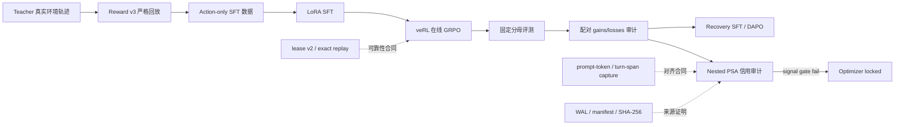

# Shopping GRPO Long-Horizon

<div align="center">

**简体中文** · [English](README.en.md)

**面向长程工具 Agent 的可审计后训练与失败诊断系统**

[](pyproject.toml)
[](https://github.com/QwenLM/Qwen3)
[](https://github.com/verl-project/verl)
[](https://arxiv.org/pdf/2601.18225)
[](docs/evaluation.md)

教师轨迹与 Action-only SFT → veRL 在线 GRPO → 固定评测 → 配对 bad case → 信用审计

</div>


> [!IMPORTANT]
> **结论先行：**本仓库已经闭合数据、训练、重放、评测与失败诊断链路，但当前实验
> **不支持“GRPO 或 PSA 带来性能提升”**。Two-seed GRPO V2 在已知 Final-200
> 回归集上为 `115/200`，低于 SFT 的 `117/200`（McNemar `p=.839`）；三轮
> Nested PSA 确认均通过工程/结构合同、未通过预注册信号门，因此优化器始终锁定。
> 本项目的可验证贡献是可靠的长程 Agent 后训练基础设施与实验判断，而不是包装涨点。

## 为什么做这个项目？

ShopSimulator 中的 Agent 不能只生成商品推荐，而要在有状态环境中持续执行：

1. 解析品类、预算、品牌、型号、功能与规格；
2. 搜索并比较候选商品；
3. 打开详情、核验参数、选择变体；
4. 在证据充分时购买或终止；
5. 从非法动作、页面切换、重复搜索和上下文截断中恢复。

因此，失败往往发生在十几到几十步之后。单个终局 Reward 很难说明究竟是哪次搜索、
规格选择或停止决策导致结果改变；异步 Rollout、环境状态、Prompt token 和训练 span
一旦没有严格对齐，也可能把基础设施错误误当成模型信号。

本项目的目标不是先换一个更复杂的 RL 算法，而是依次回答：

```text
训练数据可信么？
→ Reward 与环境状态能重放么？
→ GRPO 的有效样本真的进入更新了么？
→ 性能变化来自哪些配对轨迹？
→ 局部动作 credit 在独立 continuation 上稳定么？
→ 证据不足时能否阻止 optimizer？
```

更完整的动机、STAR 叙事、失败实验与结论边界见
[项目复盘](docs/project-retrospective.md)。

## 端到端闭环



| 模块 | 本仓库实现 | 它解决的问题 |
|---|---|---|
| 数据闭环 | 616 个唯一任务轨迹，经 Reward v3 回放筛出 428 条 strict gold，划分 385/43 | 教师输出不能直接等同于可执行监督 |
| Action-only SFT | 仅 Assistant 动作 token 计算 Loss，Mask 用户与 Observation | 避免学习环境回显内容 |
| 在线 GRPO | veRL 0.8 AgentLoop、`shopping-policy-reward-v1`、动态有效组过滤 | 区分模型负样本与基础设施无效样本 |
| 环境可靠性 | tokenized lease v2、TTL、幂等 reset、exact prefix replay | 防止并发槽泄漏、串租与状态漂移 |
| 训练对齐 | exact prompt token、assistant turn span、tensor/reward 一致性校验 | 保证 loss 落到真实 Actor 决策 |
| 可恢复采集 | capture-only、request-intent WAL、起止 actor attestation | 固定策略采集不更新参数，中断后不按结果补采 |
| 固定评测 | 200 题固定分母，Reward / Rubric / Judge / 行为四面板 | 防止只汇报成功子集或混合指标 |
| Nested PSA | 每 state 采 `K=4` 首决策，每 decision 采 `L=8` continuation，train/gate 分离 | 检验局部 credit 是否稳定，而非直接相信终局 advantage |

## 可审计实验结论

以下均为本仓库实际完成的实验。负结果保留原门槛，不根据 outcome 重新挑样本。

| 实验 | 对照与规模 | 结果 | 决策 |
|---|---|---|---|
| SFT 数据 | 616 raw → 428 strict gold → 385/43 task-disjoint | 数据、回放与 SHA-256 审计通过 | 进入 SFT；尚未重新复现上游 60.5% |
| GRPO V2 | 2 seeds × 100 updates | Final-200 `115/200` vs SFT `117/200`；11 gains / 13 losses；`p=.839` | **未提升**，不晋级 |
| Recovery SFT | 194 条 train-rollout gold recovery | `0.25x` 为 `120/200`，与 SFT 持平；wrong purchase `5→7` | 停止继续调缩放，不跑 Final |
| DAPO Clip-Higher | 1 seed、25 updates | tuning `119/200` vs SFT `120/200`；clip fraction 均值 `0.215%` | 窄消融未通过，不等同完整 DAPO |
| Query-only Nested PSA | 120 fresh tasks、80 states、320 proposals、1,944 continuations | structural ready；六项 signal gate 全部失败 | `optimizer_unlock_allowed=false` |

GRPO 的配对审计显示：13 个 losses 中有 8 个已经打开过 SFT 成功购买的商品，模型更多
是在正确候选附近继续探索、覆盖规格、循环或错过购买时机，而不是完全不会搜索。
Recovery SFT 因此先测试“补局部正监督”能否修复收尾；失败后再做 DAPO Clip-Higher
受控消融；两者均未通过预注册晋级门。完整证据见：

- [GRPO V2 实验与 11/13 配对审计](docs/grpo_v2_experiment_20260810.md)
- [Recovery SFT 实验](docs/recovery_sft_experiment_20260810.md)
- [DAPO Clip-Higher Pilot](docs/dapo.md)
- [Nested PSA 三轮确认](docs/psa_grpo.md)
- [实验总账与 claim boundary](experiments/comparison.md)

## 为什么 2B 模型仍验证在 96 GB 显卡上？

模型参数量不是这里唯一的显存项。当前 GRPO 合同同时包含约 24K 的长上下文上限、每个
Prompt 四条在线 Rollout、训练 Actor/梯度/优化器状态，以及同卡 vLLM 的 KV Cache。
长程 Observation 和多轮工具消息也进入响应张量，因此显存主要受序列长度、并行轨迹和
训练/推理共存方式影响，而不只由“2B”决定。

README 中的 96 GB 是**已验证配方**，不是理论最低配置。若要在 24/48 GB 卡上运行，应
先缩短上下文、减少 Rollout 数、分离 vLLM 与 Actor，或只跑 SFT/离线审计；不能把医疗
问答中短响应的 4B QLoRA 显存经验直接外推到 24K 多轮 Agent GRPO。

## 快速开始

所有命令在仓库根目录执行。训练、模型合并和完整 200 题评测都应先确认 GPU、配置、
输入哈希与输出目录；先用 dry-run 或 smoke 验证合同。

### 1. 安装与环境

```bash
bash scripts/setup.sh
bash scripts/start_environment.sh
```

ShopSimulator 默认监听 `http://127.0.0.1:5700`。环境源码与冻结商品数据位于
[`environments/ShopSimulator/`](environments/ShopSimulator/)。

### 2. Baseline / SFT

```bash
bash scripts/serve_model.sh Qwen/Qwen3.5-2B
bash scripts/baseline.sh

# 释放模型服务占用的 GPU 后再训练
bash scripts/sft.sh
```

### 3. GRPO

先解析完整命令，不启动 CUDA 或 Ray：

```bash
bash scripts/grpo.sh --dry-run
```

确认配置后再执行：

```bash
bash scripts/grpo.sh
```

Checkpoint、Rollout、manifest 和完整日志写入 Git 忽略的 `outputs/`。详细流程见
[GRPO 指南](docs/grpo.md)。

### 4. 测试

```bash
uv run --extra dev python -m pytest -q \
  tests/test_public_entrypoints.py \
  tests/test_action_validation.py \
  tests/test_benchmark.py \
  tests/test_evaluation_badcase.py \
  tests/test_sft_collection.py \
  tests/test_active_branch.py \
  tests/test_pivotal_selection.py \
  tests/test_stage1_proposal.py \
  tests/test_nested_artifacts.py \
  tests/test_nested_credit.py
```

这是不依赖 veRL 与 ShopSimulator 运行时的 CPU 合同测试。完整集成测试需要项目的
veRL 环境与 ShopSimulator Python 路径，不能只安装 `dev` extra 后直接运行。

## 仓库结构

```text
configs/                         SFT、GRPO、DAPO、AgentLoop 与工具配置
data/
  sft/                           385 train + 43 validation action-only 轨迹
  grpo/                          JSONL 与 veRL Parquet 训练数据
  evaluation/                    固定 200 题回归集
docs/                            设计、实验、评测与项目复盘
environments/ShopSimulator/      内嵌环境与 tokenized lease v2 服务
experiments/                     小型可提交结果、上游历史基准与结论总账
patches/                         带版本和 SHA-256 检查的 veRL 补丁
scripts/                         用户入口、审计、replay 与 nested collection CLI
src/shopping_grpo/
  collection/                    教师轨迹验收与 SFT 数据构造
  environment/                   HTTP client、工具、Observation 与 manifest
  training/sft/                  action-only masking 与 recovery 数据
  training/grpo/                 AgentLoop、replay、selection、PSA、WAL 与 credit gate
  evaluation/                    硬检查、Rubric、Judge、配对统计与行为审计
tests/                           核心单元、入口、回放、并发和 artifact 合同
```

## 结果边界

| 可以主张 | 不能主张 |
|---|---|
| 构建了可重放、可恢复、防泄漏的长程 Agent 后训练与评测系统 | 当前方法提升了 SFT 或优于 GRPO 基线 |
| 完成 two-seed GRPO、Recovery SFT、DAPO 与 Nested PSA 的受控实验 | PSA-GRPO 已训练、有效或具有学术首创性 |
| 正式负结果定位了停止、规格覆盖与 continuation 噪声问题 | 上游 `0%→60.5%→62%` 是本仓库当前数据复现结果 |
| 96 GB 单卡配方已实际验证 | 96 GB 是 2B 模型的理论最低需求 |

旧 Final-200 已被用于多轮回归分析，今后只能称为**已知回归集**，不能再称盲测。下一次
性能主张需要新的、从未查看的测试集，以及至少两个训练 seed 的配对统计。

## 文档导航

- [项目复盘：动机 → 方案 → 结果 → 反思](docs/project-retrospective.md)
- [数据采集与来源](docs/data-collection.md)
- [Action-only LoRA SFT](docs/sft.md)
- [veRL GRPO](docs/grpo.md)
- [Reward v3](docs/reward-v3.md)
- [固定分母评测](docs/evaluation.md)
- [文档索引](docs/README.md)

## 引用与致谢

本项目建立在 [ShopSimulator](https://arxiv.org/pdf/2601.18225)、
[veRL](https://github.com/verl-project/verl) 与
[Qwen](https://github.com/QwenLM/Qwen3) 之上。评测设计参考了
[VitaBench](https://arxiv.org/pdf/2509.26490) 与
[EComAgentBench](https://arxiv.org/pdf/2606.17698)。仓库早期结构与教程呈现参考了
[qiqihezh/agentic-grpo-longhorizon](https://github.com/qiqihezh/agentic-grpo-longhorizon)。
